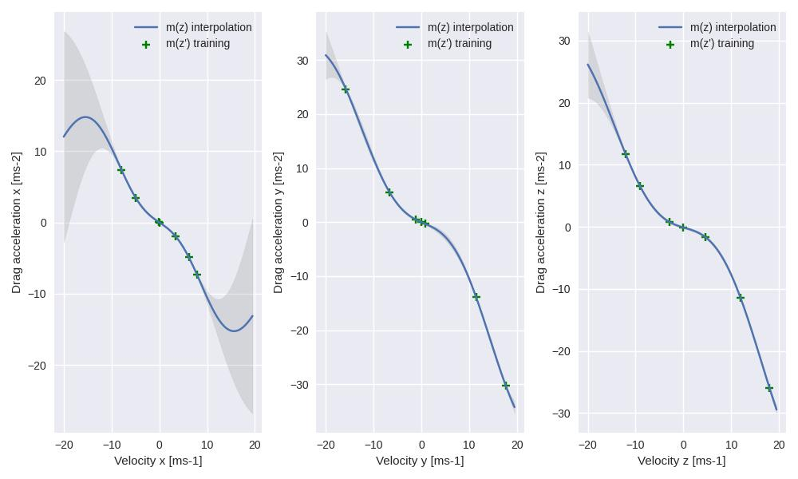
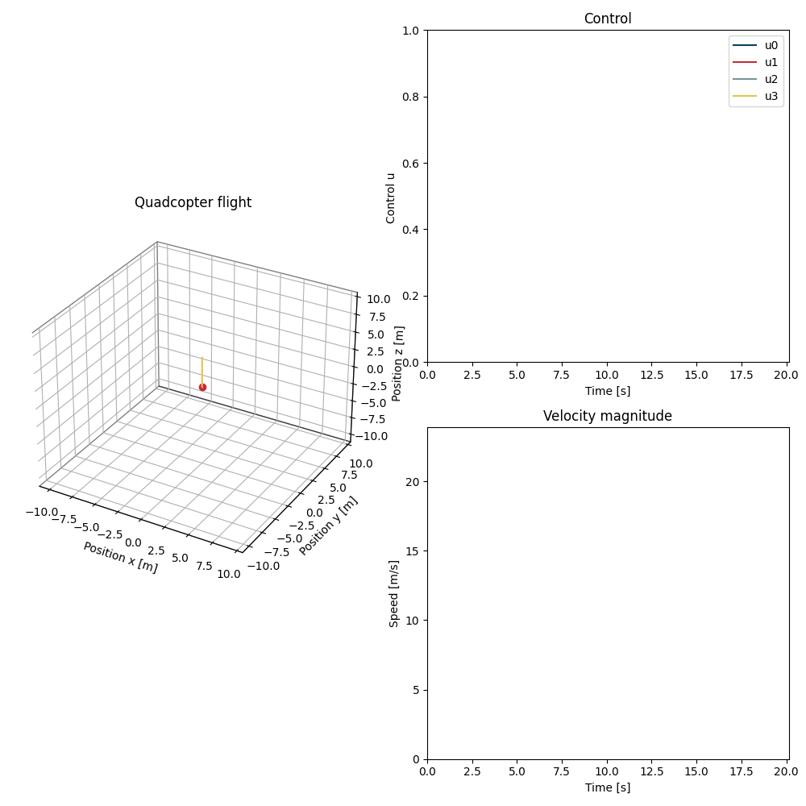

# MPC control of quadcopter using Gaussian processes 
Implementation of MPC controller for a quadrocopter model using python. This repository implements the framework as described in [[1]](#1)

Using a python simulation, we tracked a trajectory using an MPC controller. The simulated quadcopter was subject to a quadratic air resistence term which the MPC prediction model does not have access to. This caused a difference between the predicted velocities and the actual velocities of the quadcopter. 

$$\hat{a}_{error} = \frac{v_{true}-v_{\text{pred}}}{\Delta t}$$

Using a [Gaussian process](https://github.com/smidmatej/Gaussian-process) regression, we can fit the acceleration error in axis x to a velocity in x (and for y and z too). Regression allows us access to the mean function $m(v_x)$ and its variance $\text{var}(v_x)$. We use m(v_x) to predict drag acceleration experienced by the quadcopter.

$$\hat{a}_{\text{drag}_x} = m(v_x)$$

Since the MPC controller uses Acados for its predictions, to augment the prediction model with the Gaussian process, we implement a casadi version of Gaussian process regression. This also allows us to compute a symbolic derivative of the GP predictions w.r.t velocity. 

The Gaussian process allows us its predictions to make better predictions with the MPC controller, especially at higher velocities, where air resistance becomes more of a factor.

$$\ddot{\textbf{x}} = f(\textbf{x}) + \hat{ \textbf{a} }_{\text{drag}}$$

Using a MPC controller augmented with the Gaussian process, we are able to reach significantly higher speeds 

## References
<a id="1">[1]</a> 
G. Torrente, E. Kaufmann, P. Föhn and D. Scaramuzza, "Data-Driven MPC for Quadrotors," in IEEE Robotics and Automation Letters, vol. 6, no. 2, pp. 3769-3776, April 2021, doi: 10.1109/LRA.2021.3061307.