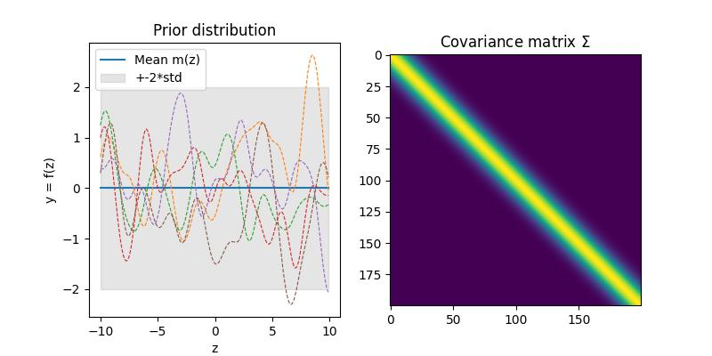
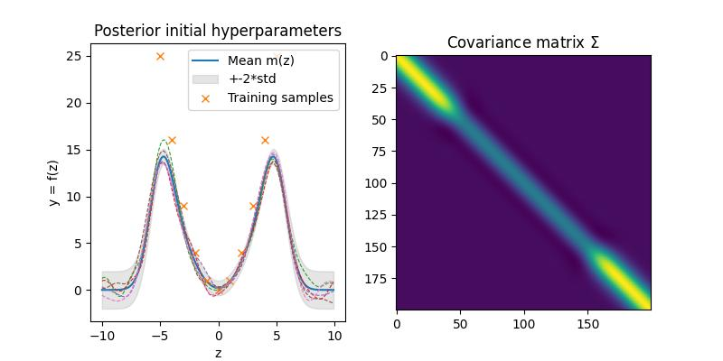
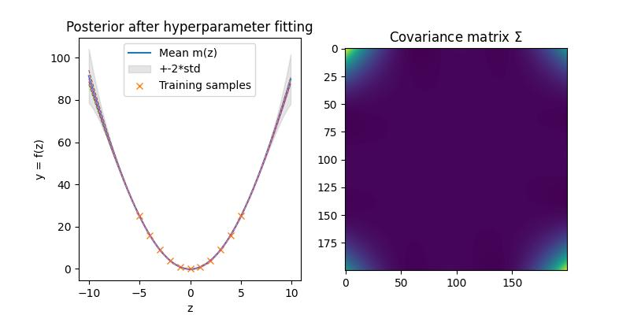

# Gaussian-process
Implementation of Gaussian process using numpy. This repository implements Gaussian processes as described in [[1]](#1)

Samples are drawn from the prior distribution without any training data and with initial hyperparameters

Adding training samples drawn from f(z) = z^2. The Gaussian process is able to create prediction but the selected hyperparameters are not ideal.

Using a negative log likelyhood minimization, the hyperparameters are fitted to the training data, producing more reliable predictions

## References
<a id="1">[1]</a> 
Rasmussen, C.E. and Williams, C.K.I. (2005). 
Gaussian Processes for Machine Learning
